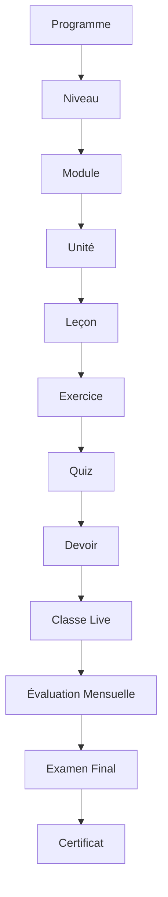
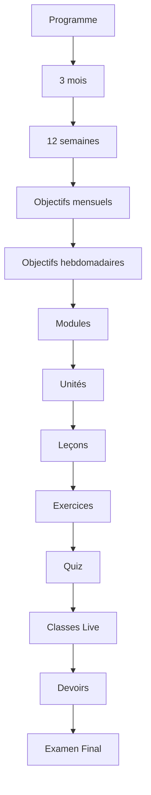
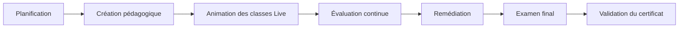
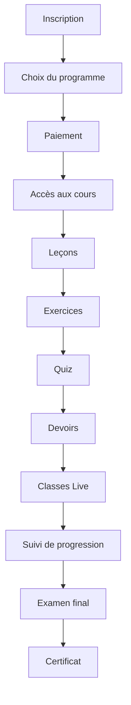
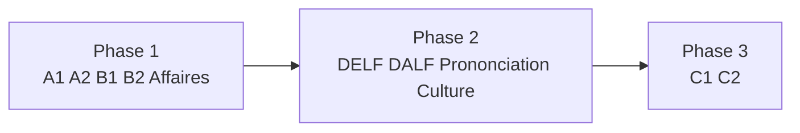

# Manuel Officiel du Programme Académique
## Francophone Academy

Version: 1.0  
Statut: Référentiel académique officiel  
Langue de référence: Français

---

## Table des matières

1. [Présentation institutionnelle et philosophie pédagogique](#1-présentation-institutionnelle-et-philosophie-pédagogique)
2. [Hiérarchie académique complète](#2-hiérarchie-académique-complète)
3. [Programmes officiels de Francophone Academy](#3-programmes-officiels-de-francophone-academy)
4. [Structure pédagogique complète](#4-structure-pédagogique-complète)
5. [Rôle et responsabilités des enseignants](#5-rôle-et-responsabilités-des-enseignants)
6. [Parcours complet de l'étudiant](#6-parcours-complet-de-létudiant)
7. [AI Teaching Assistant (enseignants)](#7-ai-teaching-assistant-enseignants)
8. [Tuteur IA (étudiants)](#8-tuteur-ia-étudiants)
9. [Politique tarifaire officielle](#9-politique-tarifaire-officielle)
10. [Feuille de route académique](#10-feuille-de-route-académique)
11. [Annexe: Contrôle de cohérence académique](#11-annexe-contrôle-de-cohérence-académique)

---

## 1. Présentation institutionnelle et philosophie pédagogique

Francophone Academy est une académie numérique dédiée à l'apprentissage structuré, progressif et certifiant du français. Son modèle combine excellence pédagogique, rigueur académique et accompagnement personnalisé.

### 1.1 Vision académique

Francophone Academy forme des apprenants capables de communiquer, d'évoluer professionnellement et de réussir des certifications internationales en français.

### 1.2 Philosophie pédagogique

Notre pédagogie repose sur cinq principes:

1. Progression structurée par niveaux, modules et résultats mesurables.
2. Alternance entre apprentissage guidé, pratique active et évaluation continue.
3. Alignement systématique entre objectifs, contenus, activités et certification.
4. Accompagnement humain constant par des enseignants qualifiés.
5. Exploitation raisonnée de l'IA comme outil d'appui pédagogique.

### 1.3 Alignement CECRL

Les programmes de Francophone Academy suivent le CECRL (Cadre Européen Commun de Référence pour les Langues) pour les niveaux A1 à C2, avec des déclinaisons spécialisées (Affaires, DELF, DALF, Prononciation, Culture Francophone).

### 1.4 Place centrale des enseignants

Les enseignants sont au centre de l'académie. Ils conçoivent, adaptent, animent, corrigent et valident l'ensemble du parcours académique. L'IA ne remplace jamais l'expertise pédagogique humaine.

### 1.5 Rôle de l'IA

L'IA accompagne les pratiques d'enseignement et d'apprentissage. Elle accélère la préparation et soutient les interactions pédagogiques, mais toute validation académique officielle reste de la responsabilité des enseignants et de la direction académique.

---

## 2. Hiérarchie académique complète

### 2.1 Schéma institutionnel

### 2.2 Rôle de chaque élément

| Élément | Rôle académique | Sortie attendue |
|---|---|---|
| Programme | Cadre global d'apprentissage et de certification | Parcours complet validé |
| Niveau | Positionnement CECRL ou spécialisé | Compétences de niveau atteintes |
| Module | Regroupement thématique majeur | Bloc de compétences consolidé |
| Unité | Sous-ensemble opérationnel du module | Résultats d'apprentissage ciblés |
| Leçon | Séquence pédagogique guidée | Acquisition d'un objectif précis |
| Exercice | Pratique formative | Renforcement et automatisation |
| Quiz | Mesure rapide des acquis | Score formatif et remédiation |
| Devoir | Production appliquée évaluée | Performance contextualisée |
| Classe Live | Interaction synchrone avec enseignant | Feedback et correction en temps réel |
| Évaluation Mensuelle | Jalon de contrôle de progression | Décision pédagogique mensuelle |
| Examen Final | Validation sommative du niveau | Admissibilité au certificat |
| Certificat | Reconnaissance officielle de réussite | Attestation académique |

---

## 3. Programmes officiels de Francophone Academy

### 3.1 Catalogue officiel

Francophone Academy propose les 11 programmes officiels suivants:

1. Français A1 - Fondations
2. Français A2 - Vie Quotidienne
3. Français B1 - Indépendance
4. Français B2 - Excellence
5. Français C1 - Leadership Professionnel
6. Français C2 - Expert International
7. Français des Affaires
8. Préparation DELF
9. Préparation DALF
10. Prononciation
11. Culture Francophone

### 3.2 Fiches académiques par programme

| Programme | Durée | Public concerné | Objectifs | Compétences visées | Résultats attendus | Mode d'évaluation | Conditions d'obtention du certificat |
|---|---|---|---|---|---|---|---|
| Français A1 - Fondations | 3 mois | Débutants absolus ou faux débutants | Acquérir les bases de communication quotidienne | Se présenter, comprendre des consignes simples, produire des phrases courtes | Communication de survie en contexte quotidien | Quiz hebdomadaires, devoirs simples, 1 évaluation mensuelle, examen final | Assiduité >= 80%, moyenne quiz >= 65%, devoirs >= 65%, examen final validé, progression 100% |
| Français A2 - Vie Quotidienne | 3 mois | Apprenants ayant validé A1 | Développer l'autonomie dans la vie courante | Interaction en situation pratique, narration simple, compréhension fonctionnelle | Échanges courts et fluides sur sujets familiers | Quiz, devoirs appliqués, évaluation mensuelle, examen final | Assiduité >= 80%, moyenne quiz >= 70%, devoirs >= 70%, examen final validé, progression 100% |
| Français B1 - Indépendance | 3 mois | Apprenants intermédiaires | Renforcer l'expression et l'argumentation de base | Prise de parole continue, rédaction structurée, compréhension de médias | Autonomie linguistique sur thèmes sociaux et personnels | Quiz, travaux argumentatifs, classe live évaluée, évaluation mensuelle, examen final | Assiduité >= 82%, moyenne quiz >= 72%, devoirs >= 72%, examen final validé, progression 100% |
| Français B2 - Excellence | 3 mois | Apprenants avancés | Consolider la fluidité, la nuance et la précision | Argumentation avancée, synthèse, communication professionnelle | Maîtrise fonctionnelle avancée en contexte académique et professionnel | Quiz avancés, devoirs analytiques, live classes, évaluation mensuelle, examen final | Assiduité >= 85%, moyenne quiz >= 75%, devoirs >= 75%, examen final validé, progression 100% |
| Français C1 - Leadership Professionnel | 3 mois | Cadres, professionnels, apprenants très avancés | Maîtriser l'expression académique et professionnelle | Synthèse experte, prise de décision linguistique, communication d'influence | Production orale et écrite de haut niveau | Quiz spécialisés, dossiers professionnels, évaluation mensuelle, examen final | Assiduité >= 85%, moyenne quiz >= 78%, devoirs >= 80%, examen final validé, progression 100% |
| Français C2 - Expert International | 3 mois | Experts linguistiques et profils internationaux | Atteindre une maîtrise experte du français | Rhétorique avancée, adaptation fine au contexte, précision maximale | Performance proche d'un locuteur expert en contexte complexe | Quiz experts, productions longues, évaluations orales, évaluation mensuelle, examen final | Assiduité >= 88%, moyenne quiz >= 80%, devoirs >= 82%, examen final validé, progression 100% |
| Français des Affaires | 3 mois | Professionnels, managers, entrepreneurs | Communiquer efficacement en entreprise | Négociation, présentation, rédaction professionnelle | Performance opérationnelle en français professionnel | Quiz métier, études de cas, simulation live, évaluation mensuelle, examen final | Assiduité >= 85%, moyenne quiz >= 75%, devoirs >= 78%, examen final validé, progression 100% |
| Préparation DELF | 3 mois | Candidats aux examens DELF | Préparer méthodiquement les épreuves DELF | Gestion du temps, stratégies d'examen, conformité aux critères officiels | Amélioration des scores blancs et préparation à l'examen officiel | Examens blancs, quiz ciblés, ateliers live, évaluation mensuelle, examen final | Assiduité >= 85%, moyenne quiz >= 75%, devoirs >= 75%, examen final validé, progression 100% |
| Préparation DALF | 3 mois | Candidats DALF (C1/C2) | Préparer les épreuves DALF exigeantes | Analyse, synthèse, argumentation complexe, oral avancé | Capacité de réussite aux standards DALF | Simulations DALF, quiz méthodologiques, devoirs complexes, évaluation mensuelle, examen final | Assiduité >= 88%, moyenne quiz >= 78%, devoirs >= 80%, examen final validé, progression 100% |
| Prononciation | 3 mois | Tous niveaux souhaitant corriger l'oral | Améliorer intelligibilité, rythme et intonation | Discrimination auditive, production phonétique, auto-correction | Prononciation plus claire et plus naturelle | Exercices phonétiques, enregistrements corrigés, live coaching, évaluation mensuelle, examen final oral | Assiduité >= 80%, moyenne quiz >= 70%, devoirs >= 72%, examen final validé, progression 100% |
| Culture Francophone | 3 mois | Apprenants intéressés par l'ouverture interculturelle | Comprendre les réalités socioculturelles francophones | Analyse culturelle, communication interculturelle, contextualisation | Meilleure adaptation linguistique et culturelle | Quiz culturels, projets, présentations live, évaluation mensuelle, examen final | Assiduité >= 75%, moyenne quiz >= 68%, devoirs >= 70%, examen final validé, progression 100% |

---

## 4. Structure pédagogique complète

### 4.1 Schéma de déploiement d'un programme

### 4.2 Cadence pédagogique standard

| Échelle | Cadence | Finalité |
|---|---|---|
| Programme | 3 mois | Atteindre les objectifs de niveau et préparer la certification |
| Mensuel | 1 cycle par mois | Vérifier la progression globale et ajuster la remédiation |
| Hebdomadaire | 1 plan par semaine | Structurer les acquis de proximité |
| Leçon | Séquencée | Construire la compétence opérationnelle |
| Évaluation | Continue + sommative | Garantir la qualité académique et la validité du certificat |

### 4.3 Logique d'évaluation dans le cycle 3 mois

1. Évaluation continue hebdomadaire: exercices, quiz, devoirs.
2. Évaluation mensuelle: contrôle de palier, décision d'accompagnement.
3. Examen final: validation sommative du programme.
4. Certification: délivrance après satisfaction de tous les critères académiques.

---

## 5. Rôle et responsabilités des enseignants

Les enseignants assurent l'intégralité de la qualité pédagogique et certificative.

### 5.1 Missions pédagogiques

1. Préparer les cours et planifications pédagogiques.
2. Créer les leçons et les contenus d'apprentissage.
3. Créer les exercices de pratique ciblée.
4. Créer les quiz formatifs et checkpoints.
5. Créer les devoirs applicatifs.
6. Planifier les classes Live selon objectifs et besoins.
7. Corriger les productions des étudiants et fournir un feedback actionnable.
8. Valider les conditions d'obtention des certificats.
9. Utiliser l'AI Teaching Assistant comme outil de productivité et de qualité.

### 5.2 Schéma opérationnel enseignant

---

## 6. Parcours complet de l'étudiant

Le parcours étudiant suit un continuum académique clair, traçable et certifiant.

### 6.1 Étapes du parcours

1. Inscription
2. Choix du programme
3. Paiement
4. Accès aux cours
5. Leçons
6. Exercices
7. Quiz
8. Devoirs
9. Classes Live
10. Suivi de progression
11. Examen final
12. Obtention du certificat

### 6.2 Schéma du parcours étudiant

### 6.3 Principes de progression

- La progression est séquencée et mesurée.
- Les retours pédagogiques sont continus.
- Le certificat est conditionné à des preuves d'apprentissage.

---

## 7. AI Teaching Assistant (enseignants)

L'AI Teaching Assistant est un assistant pédagogique professionnel, accessible uniquement aux enseignants.

### 7.1 Capacités autorisées

Il peut:

- proposer un plan de cours
- générer des exercices
- générer des quiz
- générer des devoirs
- générer des examens
- générer des résumés
- générer des scripts HeyGen
- proposer des améliorations pédagogiques

### 7.2 Règle académique de gouvernance

Il ne publie jamais automatiquement. Le professeur valide toujours avant diffusion aux étudiants.

### 7.3 Position institutionnelle

L'outil soutient la conception et l'amélioration continue, mais n'exerce aucune autorité académique autonome.

---

## 8. Tuteur IA (étudiants)

Le Tuteur IA est un dispositif d'accompagnement pédagogique pour les étudiants.

### 8.1 Capacités autorisées

Il peut:

- expliquer les leçons
- répondre aux questions
- corriger la grammaire
- proposer des exercices

### 8.2 Limites strictes

Il ne peut jamais:

- attribuer une note officielle
- délivrer un certificat
- remplacer un enseignant

### 8.3 Encadrement académique

Le Tuteur IA complète le suivi enseignant. Toute validation officielle reste réalisée par les enseignants et les évaluations institutionnelles.

---

## 9. Politique tarifaire officielle

### 9.1 Principes

- Chaque programme dure 3 mois.
- Les frais sont exprimés par mois.
- Le coût total du parcours correspond à 3 mensualités.

### 9.2 Grille tarifaire de référence

| Programme | Frais mensuels | Durée | Coût total du parcours |
|---|---:|---:|---:|
| Français A1 - Fondations | ₦75,000 / mois | 3 mois | ₦225,000 |
| Français A2 - Vie Quotidienne | ₦75,000 / mois | 3 mois | ₦225,000 |
| Français B1 - Indépendance | ₦75,000 / mois | 3 mois | ₦225,000 |
| Français B2 - Excellence | ₦150,000 / mois | 3 mois | ₦450,000 |
| Français C1 - Leadership Professionnel | ₦200,000 / mois | 3 mois | ₦600,000 |
| Français C2 - Expert International | ₦250,000 / mois | 3 mois | ₦750,000 |
| Français des Affaires | ₦150,000 / mois | 3 mois | ₦450,000 |
| Préparation DELF | ₦150,000 / mois | 3 mois | ₦450,000 |
| Préparation DALF | ₦200,000 / mois | 3 mois | ₦600,000 |
| Prononciation | ₦100,000 / mois | 3 mois | ₦300,000 |
| Culture Francophone | ₦100,000 / mois | 3 mois | ₦300,000 |

### 9.3 Notes de gestion

- Les tarifs peuvent être révisés par décision de la direction.
- Toute révision s'applique aux nouvelles cohortes, sauf décision contraire explicite.

---

## 10. Feuille de route académique

### 10.1 Phase 1

- A1
- A2
- B1
- B2
- Français des Affaires

### 10.2 Phase 2

- DELF
- DALF
- Prononciation
- Culture Francophone

### 10.3 Phase 3

- C1
- C2

### 10.4 Schéma de progression institutionnelle

---

## 11. Annexe: Contrôle de cohérence académique

### 11.1 Cohérence avec l'architecture académique implémentée

Le présent manuel est cohérent avec l'architecture académique en place:

- Hiérarchie principale couverte: Programme -> Niveau -> Module -> Unité -> Leçon -> Exercice -> Quiz -> Devoir -> Classe Live -> Examen Final -> Certificat.
- Le jalon « Évaluation Mensuelle » est défini comme checkpoint pédagogique institutionnel intégré au suivi (quiz, devoirs, classe live, remédiation), sans altérer la structure technique déjà implémentée.
- Les responsabilités des enseignants et les parcours étudiants respectent la logique de progression et de certification de l'académie.

### 11.2 Gouvernance de validation

1. La direction académique valide ce document comme référentiel officiel.
2. Les enseignants appliquent ce cadre dans la conception et l'animation.
3. Toute modification future doit faire l'objet d'une mise à jour versionnée du présent manuel.

---

**Fin du Manuel Officiel du Programme Académique - Francophone Academy**
